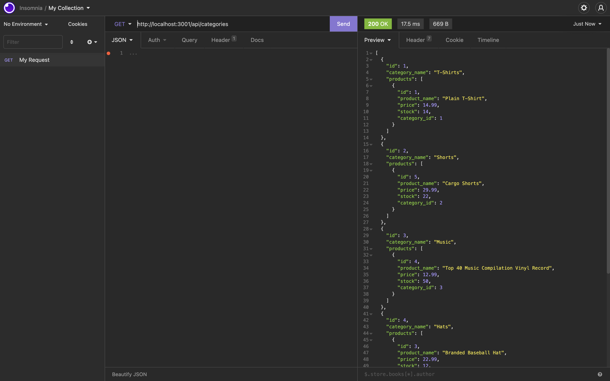
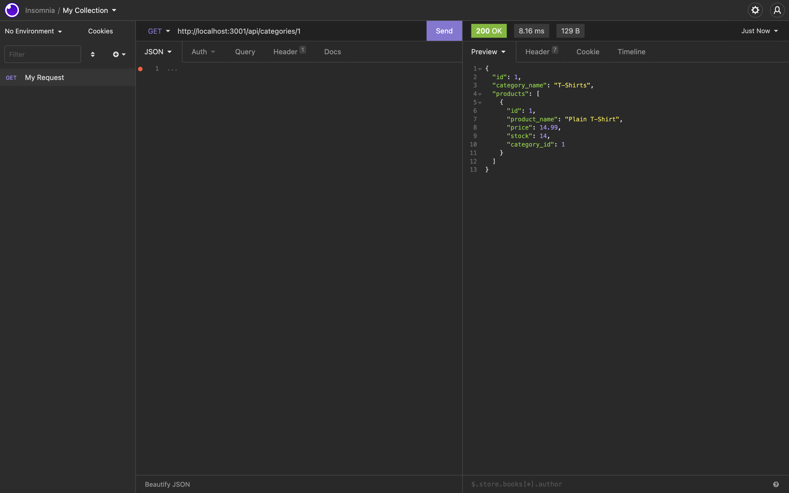
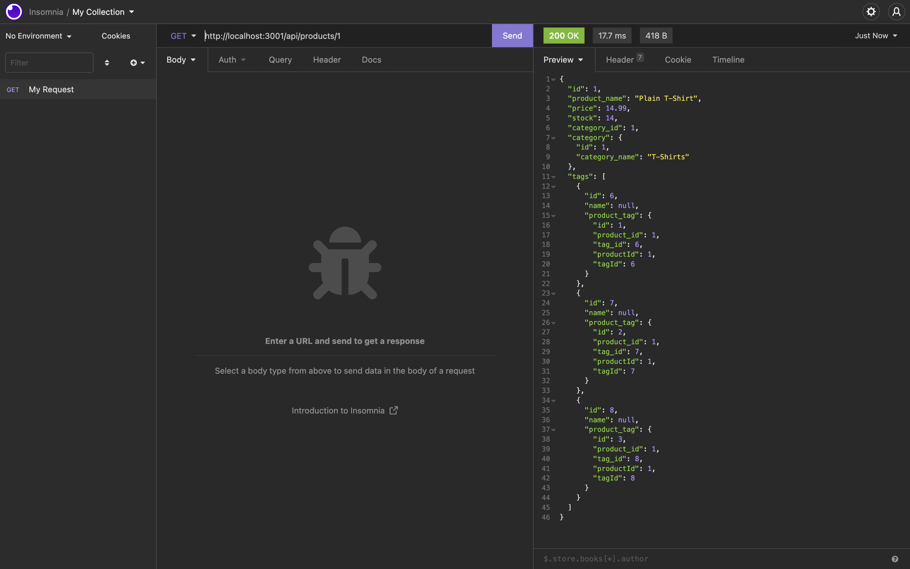
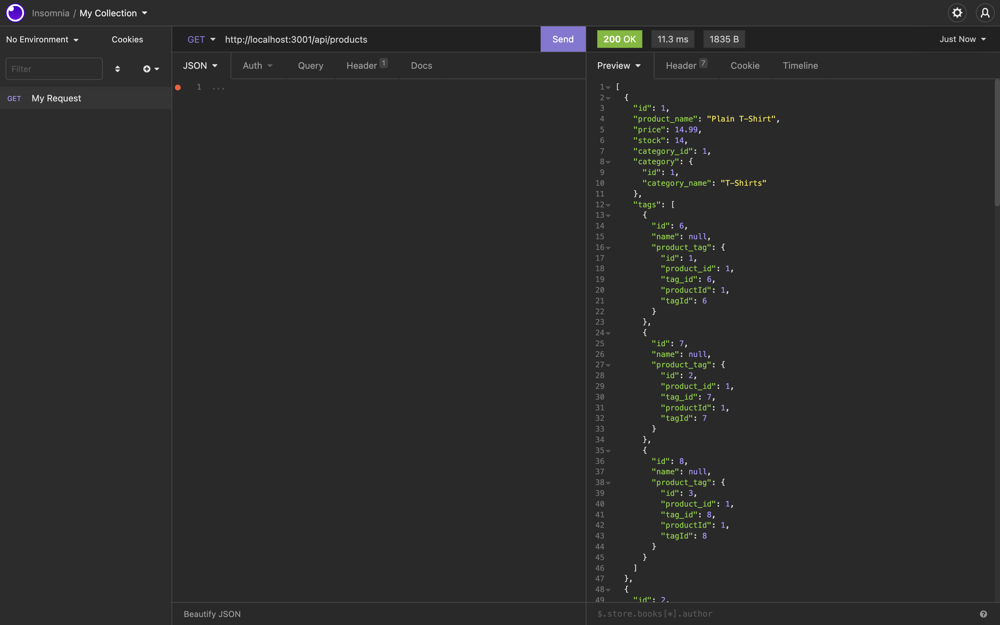

# E-Commerce-App

## Description
Created the back end for an e-commerce site by configuring a working Express.js API to use Sequelize to interact with the MySQL database ecommerce_db. Seeds pre-populate the data to ecommerce_db to test the routes functionalities. 

## User Story

AS A manager at an internet retail company
I WANT a back end for my e-commerce website that uses the latest technologies
SO THAT my company can compete with other e-commerce companies

## Acceptance Criteria

```md
GIVEN a functional Express.js API
WHEN I add my database name, MySQL username, and MySQL password to an environment variable file
THEN I am able to connect to a database using Sequelize
WHEN I enter schema and seed commands
THEN a development database is created and is seeded with test data
WHEN I enter the command to invoke the application
THEN my server is started and the Sequelize models are synced to the MySQL database
WHEN I open API GET routes in Insomnia for categories, products, or tags
THEN the data for each of these routes is displayed in a formatted JSON
WHEN I test API POST, PUT, and DELETE routes in Insomnia
THEN I am able to successfully create, update, and delete data in my database
```

## Screenshots
The following screenshots show the application's GET routes to return all categories, all products, and all tags being tested in Insomnia:






## Video Walkthrough
[ScreenCastify Link](https://drive.google.com/file/d/1L9mWiFMAGyheEg8q8AfY5NkGg8YQmze2/view?usp=sharing)
